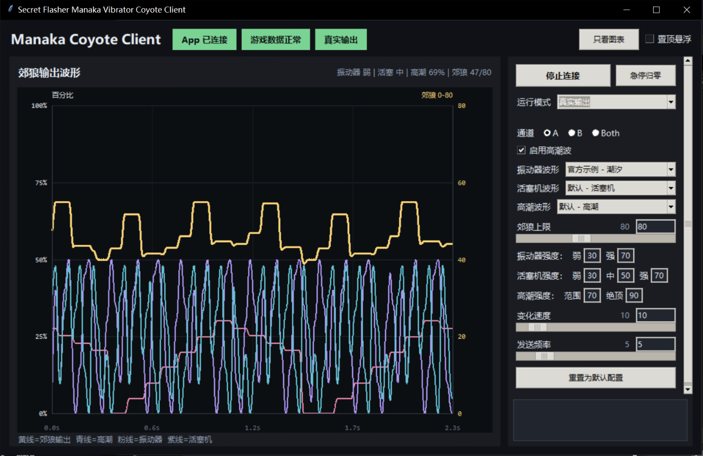

# SecretFlasherManaka2 X DGLAB

**塞雷卡 2** X **郊狼** 是一个基于 [BepInEx](https://github.com/BepInEx/BepInEx) 的 Unity MOD，用于读取 `SecretFlasherManaka v1.1.3` 游戏中的振动器、活塞机和高潮状态，并将数据发送到电脑客户端进行波形叠加，再通过 DG-Lab 郊狼输出。

本项目由两部分组成：

- `plugin`：安装到游戏 BepInEx 的插件，读取游戏状态并通过本机 UDP 发送数据。
- `client`：连接 DG-Lab App、显示波形并控制郊狼输出的客户端。

游戏本体不包含在项目中。

## 使用示例



## 安装

1. 从 [Releases 下载 MOD](https://github.com/kusadact/SecretFlasherManaka2_X_DGLAB/releases)。
2. 将压缩包内的全部文件和文件夹复制到本地游戏根目录：

   ```text
   SecretFlasherManaka v1.1.3\
   ```

   如果系统提示合并文件夹，选择合并即可。

3. 确认目录结构类似下面这样：

   ```text
   SecretFlasherManaka v1.1.3\
   ├─ BepInEx\plugins\SecretFlasherManakaCoyoteLink.dll
   ├─ client\Secret Flasher Manaka Vibrator Coyote Client.exe
   ├─ start-client.bat
   └─ start-game-and-client.bat
   ```

## 启动和使用

1. 使用 `start-client.bat` 只启动客户端，或使用 `start-game-and-client.bat` 同时启动客户端和游戏。
2. 扫描客户端中的二维码，连接 DG-Lab App。电脑和手机需要处于同一网络环境。
3. 启动游戏并进入可以使用振动器的场景。
4. 确认客户端显示“游戏数据正常”。
5. 第一次使用时先保持“测试模式”，确认波形和模拟强度正常。
6. 确认无误后，再把运行模式切换为“真实输出”。

游戏中按 `F8` 可以暂停数据和输出，按 `F12` 可以急停归零。

## 客户端说明

GUI内强度设置数值为上限强度的百分比，游戏内随机档会根据当前实际落到对应档位取值。

### 输出通道与 B 通道倍率设置

- **通道选择**：支持单通道（`A`、`B`）及双通道（`Both`）输出。
- **B 通道倍率**：选择 `Both` 时，通道单选框右侧会出现倍率输入框及说明行：
  - **计算公式**：`B 通道强度 = A 通道强度 × 倍率`（A 通道输出基准强度，B 通道按倍率同步缩放）。
  - **取值范围**：`0.1` ~ `10.0`（默认 `1.0`，保留 1 位小数）。

### 自定义波形

将 `.pulse` 波形文件放入客户端 EXE 同目录的 `pulse` 文件夹，重新启动客户端后即可在波形下拉框中选择。

## 插件配置

插件第一次加载后，会在以下位置生成配置文件：

```text
BepInEx\config\secretflashermanaka.coyotelink.vibrator.cfg
```

常用配置如下：

| 配置 | 作用 |
| --- | --- |
| `ToggleKey` | 暂停/恢复按键，默认 `F8`。 |
| `PanicKey` | 急停按键，默认 `F12`。 |

修改插件配置后需要重新启动游戏。

## 从源码构建客户端

构建环境需要 64 位 Python 3.10 或更高版本。

在项目根目录使用 PowerShell 执行：

```powershell
.\client\build.ps1
```

脚本会在 `client\.venv-build` 中创建隔离的构建环境，安装锁定的运行和构建依赖，并生成：

```text
client\dist\Secret Flasher Manaka Vibrator Coyote Client.exe
```

如果 Python 命令不是默认的 `python`，可以通过参数指定：

```powershell
.\client\build.ps1 -Python "C:\Python312\python.exe"
```

## 从源码构建插件

构建环境需要：

- .NET 6 SDK
- 已安装 BepInEx 6 的 `SecretFlasherManaka v1.1.3`
- 至少通过 BepInEx 启动过一次游戏，以生成 `BepInEx\interop` 程序集

在项目根目录执行：

```powershell
.\plugin\build.ps1 -GameDir "C:\Games\SecretFlasherManaka v1.1.3"
```

生成的插件位于：

```text
plugin\dist\SecretFlasherManakaCoyoteLink.dll
```

也可以设置环境变量 `SECRET_FLASHER_MANAKA_GAME_DIR` 指向游戏根目录，之后直接执行 `.\plugin\build.ps1`。游戏本体及其 Interop 程序集仅作为本地编译依赖，不应提交到仓库。

## 贡献

欢迎通过 [Issue](https://github.com/kusadact/SecretFlasherManaka2_X_DGLAB/issues) 提交问题或建议，也欢迎直接发起 [Pull Request](https://github.com/kusadact/SecretFlasherManaka2_X_DGLAB/pulls)。
